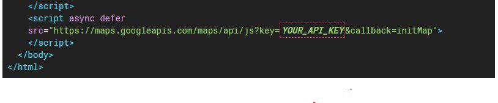

# Hackathon_BHMap_WSS
## Evento UNIBHParty - Hackathon

### Plataformas
- **Aplicação Mobile** para cadastro de ocorrências e recebimento dos chamados pelo agente
- **Aplicação Web** que comunique com o App para possibilitar a consulta da localidade das ocorrências e enviar o chamado novamete para o app do agente que estiver mais próximo para atendê-la

### Descrição

    Será criado um sistema facilitador, para uso do Centro Integrado de Operações de Belo Horizonte(COP-BH), para que o funcionário no COP possa alocar uma ocorrência para o agente correto e que esteja mais próximo da localidade.

### Processo de utilização do sistema
#### Aplicação Android
- Deverá ser usada pelos agentes e por cidadãos, onde os cidadãos podem cadastrar ocorrências, como acidentes, furtos, incêndios, quedas de árvores, etc. E os agentes receberão pelo app o chamado para atendimento à ocorrência que esteja mais próxima e/ou seja mais urgente.
- É necessário que o cidadão já possua a ferramenta (App) instalada em um dispositivo móvel, para que possa cadastrar as ocorrências que visualizar, ou presenciar. Assim como o agente também deve portar um aparelho celular como instrumento de trabalho e com a aplicação instalada.

#### Aplicação Web
- Deverá ser usada no COP-BH, onde os funcionários receberão o registro de novas ocorrências cadastradas pelos cidadãos e pela própria aplicação web serão capazes de direcionar o atendimento aos agentes mais apropriados.
- Na seção "Mapa da Cidade", do site, deverá ser mostrado os pontos onde os agentes municipais se encontram.

### Necessário para utilização
- Key para utilização da API do Google

### Ferramentas utilizadas
- Firebase
- Android Studio (Java)
- Visual Studio (C#, JavaScript)
- Visual Code (HTML, CSS)
- SQL Server

###### Contato dos Criadores
- Douglas Tertuliano: <douglasjtds@gmail.com>
- Matheus Pires: <matheuswith51@hotmail.com>
- Lucas Henrique: <lucas.docs.mail@gmail.com>